# Práctica 3.1: Instalación de Tomcat y Maven para despliegue de aplicación Java

## Instalación de Tomcat
En primer lugar para la realización de la práctica instalaremos Tomcat en nuestra máquina virtual.

Con el siguiente comando instalaremos java 11, que nos será indispensable:

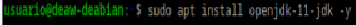

Y con este otro instalaremos Tomcat9:

Configuramos el programa y lo arrancamos con los siguientes comandos:

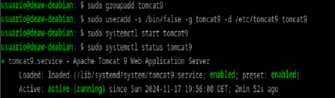

Una vez hecho esto, deberemos modificar el archivo tomcat-users.xml de la siguiente forma:

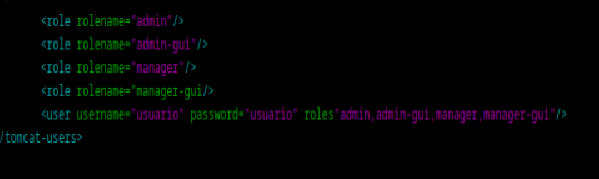

Con lo cual estamos creando nuestro usuario con su respectiva contraseña y con los privilegios enumerados con las etiquetas role.
Si en el navegador nos dirigimos a http://localhost:8080/ veremos el siguiente mensaje si todo se ha realizado correctamente:

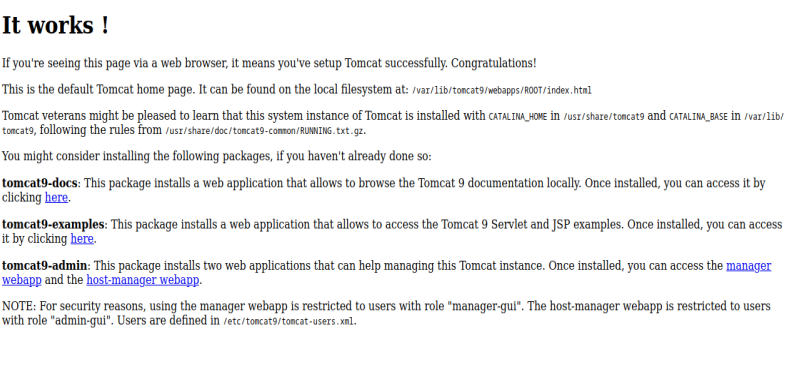

Ahora nos dirigiremos a http://localhost:8080/manager/html despúes de haber instalado en nuestra máquina tomcat9-admin y veremos lo siguiente:

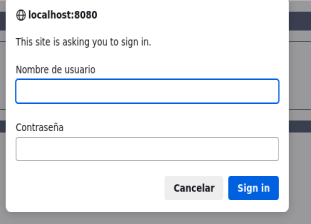

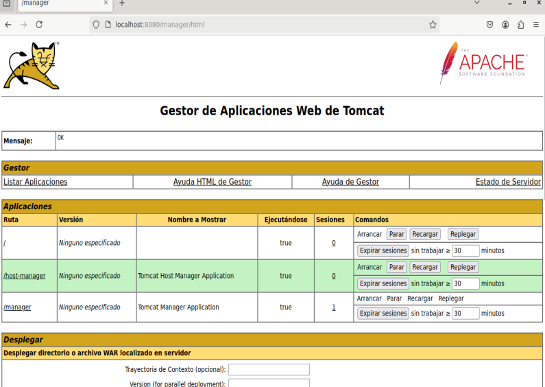

Y si accedemos a http://localhost:8080/host-manager/html, entraremos a la siguiente sección:

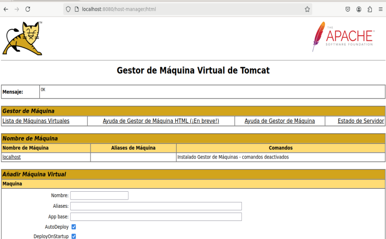

Y hasta aquí estaría realizada la isntalación.

## Despliegue manual mediante la GUI de administración

Para este paso volveremos a localhost:8080/manager, donde nos dirigiremos a la siguiente sección, donde introduciremos el archivo .war que hemos descargado previamente, de forma manual:

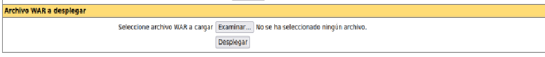

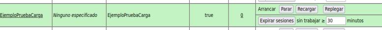

Y para comprobar que está funcionando correctamente, nos vamos a http://localhost:8080/EjemploPruebaCarga, y comprobaremos que efectivamente se ha desplegado correctamente.

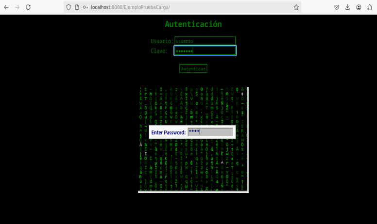

## Despliegue con Maven

Antes de comenzar advertir que esta parte no he sido capaz de ponerla en funcionamiento debido a un error que no he sabido a fecha de la realización de esta práctica como resolver, y que llegado el momento mostrare. Dicho esto, como siempre instalaremos el programa pertinente, en este caso Maven:

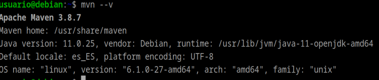

Una vez instalado, volveremos al archivo de usuarios de tomcat y añadiremos un nuevo usuario que sera el administrador del script, ya que por temas de seguridad un mismo usuario no deberia tener todos los roles simultaneamente.

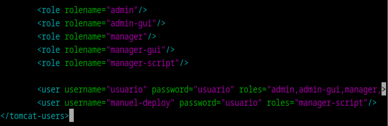

A continuación nos dirigiremos al archivo de configuración de Maven, y añadiremos las siguientes líneas, en las cuales username y password serán correspondientes a este último usuario creado.

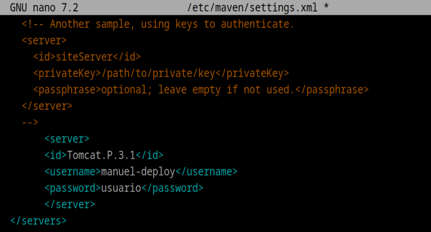

Ejecutamos el siguiente comando para crear un proyecto que usaremos de prueba:

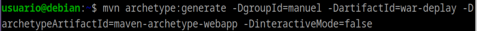

Y modificaremos el archivo pom.xml de la siguiente forma:

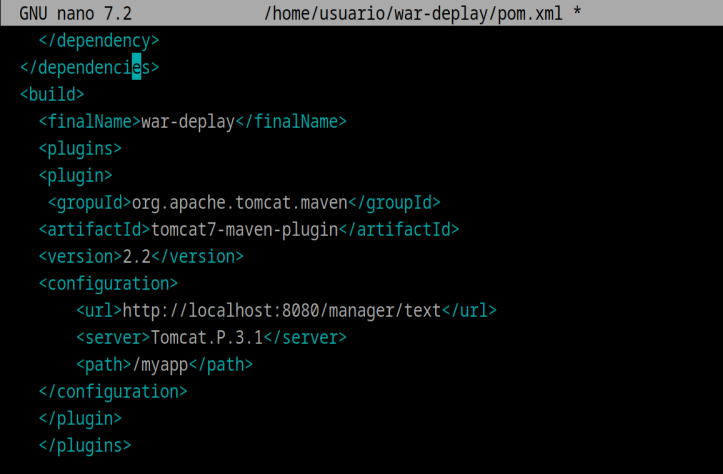

A partir de aquí al intentar desplegar tomcat7 con maven me da el siguiente error, el cual no he podido solucionar y me incapacita para terminar la práctica: 

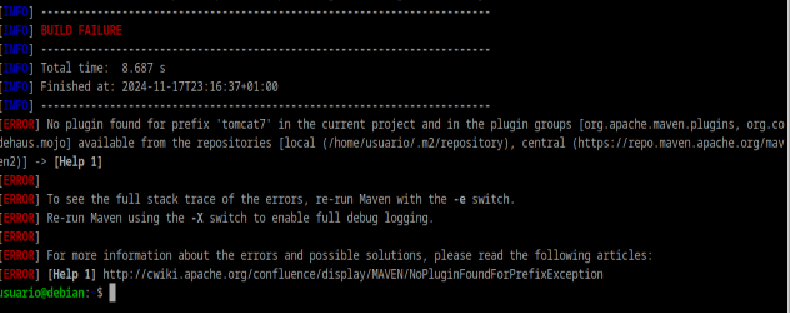